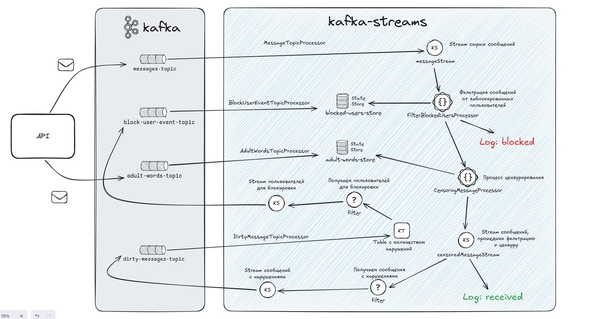

# Итоговый проект второго модуля

---

Этот проект представляет собой систему обработки потоков сообщений с функциональностью блокировки пользователей и цензуры сообщений. Ниже приведена инструкция по запуску проекта и описание его работы.

## Инструкция по запуску

Все команды выполняются в корневой директории второго модуля

### 1. Сборка проекта с помощью Maven
Для сборки проекта выполните следующую команду:
```
mvn clean package
```
Эта команда соберет все модули проекта и создаст исполняемые JAR-файлы.

### 2. Запуск кластера Kafka с помощью Docker Compose
Для запуска кластера Kafka используйте Docker Compose. Выполните следующую команду:
```
docker-compose up -d
```
Эта команда запустит все необходимые сервисы в фоновом режиме.

### 3. Запуск приложения
Для запуска выполните команду:
```
java -jar target/module_2-1.0.jar
```

И дождитесь сообщений о старте Kafka Streams и инициализации начального списка запрещенных слов

### 4. Принцип работы
- При старте приложения в топик `adult-words-topic` отправляется начальный список запрещенных слов:
```
init-data:
  adult-words:
    ипотека,
    кредит,
    инфляция,
    дефолт,
    кризис
```

- При отправке сообщения, оно попадает в топик `messages-topic`, откуда его обрабатывает `MessageTopicProcessor`.
- Затем происходит фильтрация сообщений по заблокированным отправителям (если пользователь заблокирован, то выводим в лог информацию о блокировки сообщения и обработка завершается)
- Прошедшие фильтрацию сообщения проходят цензурирование и выводим в лог информацию о получении сообщения
- Если сообщение содержало запрещенные слова, то оно попадает в топик `dirty-messages-topic`
- Отправитель, отправивший одному получателю 3 сообщения с запрещенными словами, попадет в заблокированные для этого получателя. Получатель больше не будет получать сообщения от этого отправителя

#### Принцип работы на схеме



#### Описание API
- `POST /message/send` - отправка сообщения вида:

```
{
    "senderUser": "Отправитель",
    "recipientUser": "Получатель",
    "message": "Очень важное сообщение"
}
```

- `POST /adult-words` - добавляет новые запрещенные слова
```
["сделал", "уроки"]
```

- `GET /adult-words` - получаем список запрещенных слов
- `DELETE /adult-words` - удаляет из списка запрещенных слов

```
["сделал"]
```

- `GET /blocked-users` - получение списка заблокированных отправителей для всех получателей
- `GET /blocked-users/{recipientId}` - получение списка заблокированных отправителей для конкретного получателя

### 5. Тестирование

В корне модуля лежит коллекция запросов для Postman `practicum-kafka-module2.json`

- Отправить сообщение `POST /message/send` и убедиться в логах, что сообщение получено в изначальном виде
```
  {
    "senderUser": "Сотрудник банка",
    "recipientUser": "Вовочка",
    "message": "Добрый вечер"
  }
```

- Отправить сообщение `POST /message/send` и убедиться в логах, что Получатель получил преобразованное сообщение и количество нарушений = 1
```
  {
    "senderUser": "Сотрудник банка",
    "recipientUser": "Вовочка",
    "message": "На Вас оформлен кредит"
  }
```

- Отправить сообщение `POST /message/send` и убедиться в логах, что Получатель получил преобразованное сообщение и количество нарушений = 2
```
  {
    "senderUser": "Сотрудник банка",
    "recipientUser": "Вовочка",
    "message": "А еще ипотека!"
  }
```

- Отправить сообщение `POST /message/send` и убедиться в логах, что Получатель получил преобразованное сообщение, количество нарушений = 3 и Отправитель заблокировался для Получателя
```
  {
    "senderUser": "Сотрудник банка",
    "recipientUser": "Вовочка",
    "message": "И вообще... ИНФЛЯЦИЯ! деФОлт! и КРиЗиС!"
  }
```

- Отправить сообщение `POST /message/send` и убедиться в логах, что сообщение не дошло и было заблокировано
```
  {
    "senderUser": "Сотрудник банка",
    "recipientUser": "Вовочка",
    "message": "Алло, ответьте!"
  }
```

- Получить список заблокированных пользователей `GET /blocked-users` и убедиться, что Отправитель в списке заблокированных у Получателя 
```
{
    "Вовочка": [
        "Сотрудник банка"
    ]
}
```

- Отправить сообщение `POST /message/send`, поменяв Получателя и убедиться в логах, что другому Получателю сообщения доходят
```
  {
    "senderUser": "Сотрудник банка",
    "recipientUser": "Петька",
    "message": "На Вас оформлен кредит"
  }
```

- Отправить сообщение первому Получателю `POST /message/send`, поменяв Отправителя и убедиться в логах, что от другого Отправителя первому Получателю сообщения доходят
```
  {
    "senderUser": "Папа Вовочки",
    "recipientUser": "Вовочка",
    "message": "Ты сделал уроки?"
  }
```

- Получить первичный список запрещенных слов `GET /adult-words`
```
[
    "кризис",
    "ипотека",
    "кредит",
    "инфляция",
    "дефолт"
]
```

- Добавить новые слова в список запрещенных `POST /adult-words`
```
["сделал", "уроки"]
```
Запросить список запрещенных слов и убедиться, что новые слова добавились

- Отправить сообщение `POST /message/send` и убедиться что новые запрещенные слова преобразуются
```
  {
    "senderUser": "Папа Вовочки",
    "recipientUser": "Вовочка",
    "message": "Я спрашиваю, ты сделал уроки?!?!?!"
  }
```

### Дополнение

В корне модуля лежит коллекция запросов для Postman `practicum-kafka-module2.json`

Kafka UI доступна по адресу `localhost:8085`