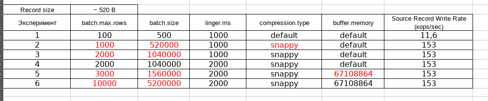

# Задание 1. Оптимизация параметров для повышения пропускной способности JDBC Source Connector

---

Игрался с разными параметрами. Сильный эффект на производительность дало увеличение `batch.size` и `compression.type = snappy`
Дальнейшие изменения эффекта не дали, максимальное значение метрики осталось на уровне 153к