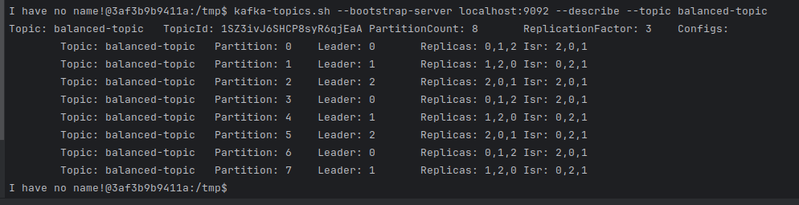

# Задание 1. Балансировка партиций и диагностика кластера

---
### 1. Создаем топик `balanced-topic` с 8 партициями и фактором репликации 3

### 2. Текущее распределение партиций

### 3. Создаем JSON-файл [reassignment.json](reassignment.json) для перераспределения партиций

### 4. Перераспределяем партиции

### 5. Проверяем статус перераспределения

### 6. Убеждаемся, что конфигурация изменилась

### 7. Моделируем сбой брокера
#### a. Останавливаем брокер `kafka-1` командой `docker stop kafka-1`
#### b. Проверяем состояние топиков после сбоя

#### c. Запускаем брокер `kafka-1` командой `docker start kafka-1`
#### d. Проверяем синхронизацию топиков после восстановления

Видим, что лидеры по брокерам не сбалансированы

#### Запустим команду выбора предпочтительного лидера

### Проверим текущее распределение партиций
