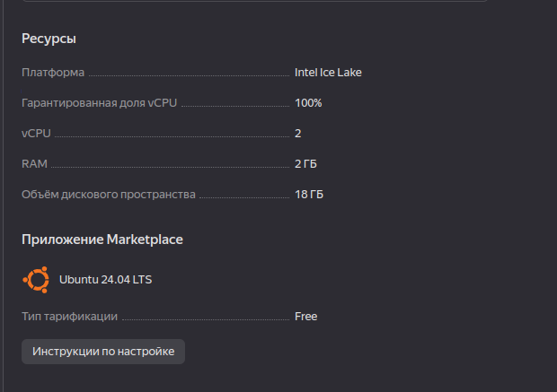
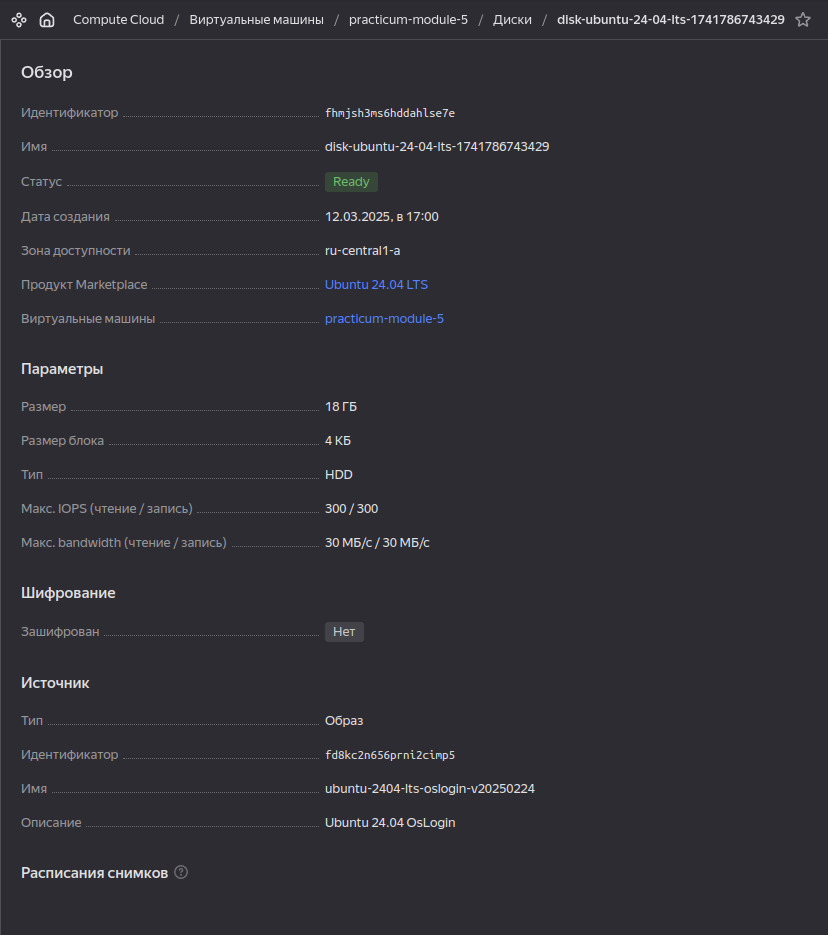
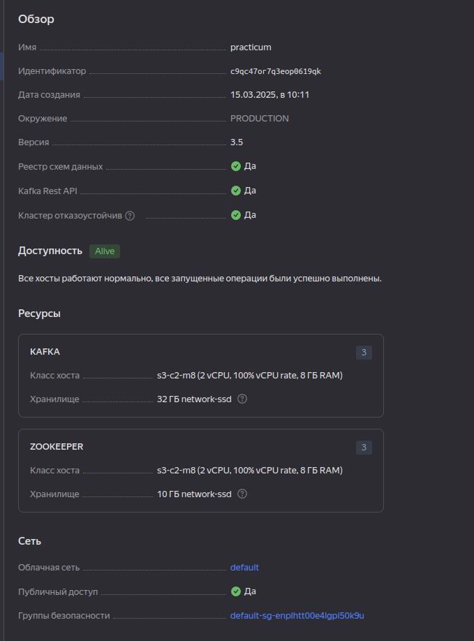
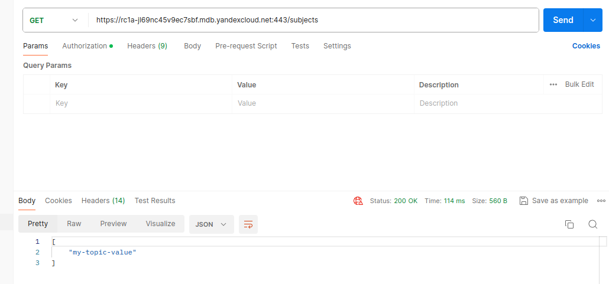
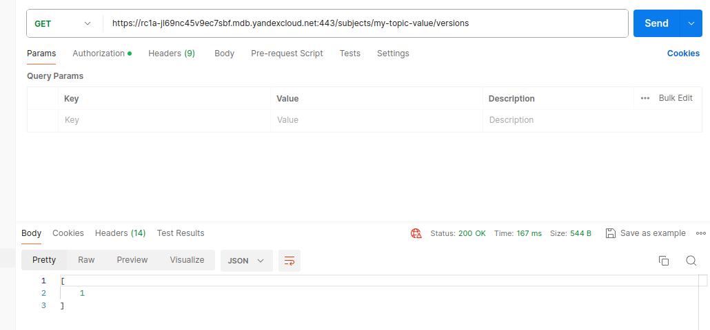
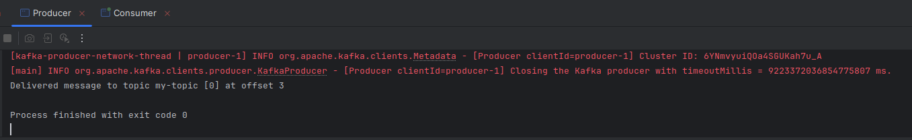
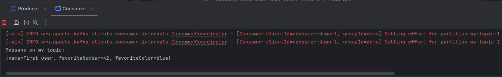

# Задание 1.Развёртывание и настройка Kafka-кластера в Yandex Cloud

---

### 1. Краткое описание выполненных шагов

1. Создал платежный аккаунт в Yandex Cloud
2. Развернул ВМ
3. Развернул кластер Kafka с Schema Registry
4. Создал в кластере топик
5. Создал приложения продюсера и консьюмера
6. Добавил схему в Schema Registry
7. Отправил сообщение из продюсера, поймал в консьюмере

### 2. Информацию по аппаратным ресурсам 
Виртуальная машина

Диск

### 3. Описание параметров кластера

### 4. Скриншоты

### 5. Код
#### [Producer](producer_5/src/main/java/com/chupakhin/App.java)
#### [Consumer](consumer_5/src/main/java/com/chupakhin/App.java)

### 6. Отправка/чтение сообщения

