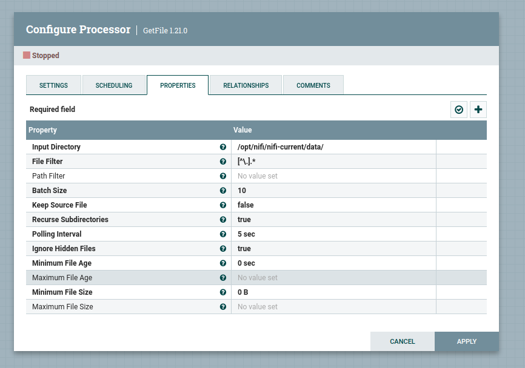
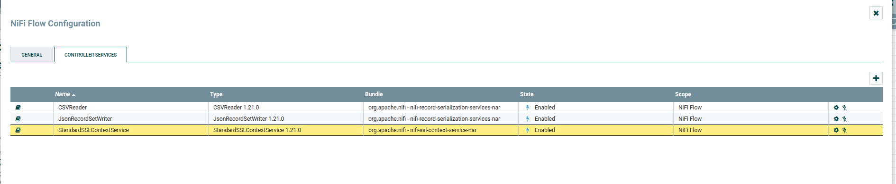

# Задание 2. Интеграция Kafka с внешними системами (Apache NiFi)

---

### 1. Конфигурация запуска NI-FI

#### [docker-compose](infra/docker-compose.yaml)

### 2. NI-FI UI

Настроил Ni-Fi на чтение CSV файла и передачу в topic Kafka


### 3. Конфигурация GetFile



### 4. Конфигурация PublishKafkaRecord


### 5. Конфигурация Controller Service



### 5.1 Конфигурация SSL CONTEXT


### 5. Файл с данными

#### [input.csv](infra/nifi_data/input.csv)


### 6. Consumer

#### [Consumer](consumer_5_2/src/main/java/com/chupakhin/App.java)

### 7. Логи консьюмера


### 7. Логи работы Ni-Fi

```
2025-03-15 14:12:32,528 INFO [pool-7-thread-1] o.a.n.c.r.WriteAheadFlowFileRepository Successfully checkpointed FlowFile Repository with 0 records in 0 milliseconds
2025-03-15T14:12:43.707097358Z 2025-03-15 14:12:43,234 INFO [NiFi Web Server-33] o.a.n.c.s.StandardProcessScheduler Starting GetFile[id=9a2282ae-0195-1000-9a21-b48a38cd198d]
2025-03-15T14:12:43.707129838Z 2025-03-15 14:12:43,234 INFO [NiFi Web Server-33] o.a.n.controller.StandardProcessorNode Starting GetFile[id=9a2282ae-0195-1000-9a21-b48a38cd198d]
2025-03-15T14:12:43.707135118Z 2025-03-15 14:12:43,239 INFO [NiFi Web Server-45] o.a.n.c.s.StandardProcessScheduler Starting PublishKafkaRecord_2_0[id=9a23e646-0195-1000-f2d4-dc3d5d1bb016]
2025-03-15T14:12:43.707139736Z 2025-03-15 14:12:43,239 INFO [NiFi Web Server-45] o.a.n.controller.StandardProcessorNode Starting PublishKafkaRecord_2_0[id=9a23e646-0195-1000-f2d4-dc3d5d1bb016]
2025-03-15T14:12:43.707143914Z 2025-03-15 14:12:43,245 INFO [Timer-Driven Process Thread-1] o.a.n.c.s.TimerDrivenSchedulingAgent Scheduled PublishKafkaRecord_2_0[id=9a23e646-0195-1000-f2d4-dc3d5d1bb016] to run with 1 threads
2025-03-15T14:12:43.707148362Z 2025-03-15 14:12:43,245 INFO [Timer-Driven Process Thread-6] o.a.n.c.s.TimerDrivenSchedulingAgent Scheduled GetFile[id=9a2282ae-0195-1000-9a21-b48a38cd198d] to run with 1 threads
2025-03-15T14:12:43.707152670Z 2025-03-15 14:12:43,328 INFO [Timer-Driven Process Thread-2] o.a.k.clients.producer.ProducerConfig ProducerConfig values: 
2025-03-15T14:12:43.707182014Z 	acks = all
2025-03-15T14:12:43.707185962Z 	batch.size = 16384
2025-03-15T14:12:43.707187825Z 	bootstrap.servers = [rc1a-jl69nc45v9ec7sbf.mdb.yandexcloud.net:9091]
2025-03-15T14:12:43.707189649Z 	buffer.memory = 33554432
2025-03-15T14:12:43.707191452Z 	client.id = 
2025-03-15T14:12:43.707193075Z 	compression.type = none
2025-03-15T14:12:43.707194748Z 	connections.max.idle.ms = 540000
2025-03-15T14:12:43.707196371Z 	enable.idempotence = false
2025-03-15T14:12:43.707198054Z 	interceptor.classes = []
2025-03-15T14:12:43.707199647Z 	key.serializer = class org.apache.kafka.common.serialization.ByteArraySerializer
2025-03-15T14:12:43.707201350Z 	linger.ms = 0
2025-03-15T14:12:43.707202943Z 	max.block.ms = 5000
2025-03-15T14:12:43.707204546Z 	max.in.flight.requests.per.connection = 5
2025-03-15T14:12:43.707206199Z 	max.request.size = 1048576
2025-03-15T14:12:43.707207832Z 	metadata.max.age.ms = 300000
2025-03-15T14:12:43.707209435Z 	metric.reporters = []
2025-03-15T14:12:43.707211028Z 	metrics.num.samples = 2
2025-03-15T14:12:43.707212721Z 	metrics.recording.level = INFO
2025-03-15T14:12:43.707214334Z 	metrics.sample.window.ms = 30000
2025-03-15T14:12:43.707215947Z 	partitioner.class = class org.apache.kafka.clients.producer.internals.DefaultPartitioner
2025-03-15T14:12:43.707217590Z 	receive.buffer.bytes = 32768
2025-03-15T14:12:43.707219193Z 	reconnect.backoff.max.ms = 1000
2025-03-15T14:12:43.707220816Z 	reconnect.backoff.ms = 50
2025-03-15T14:12:43.707222399Z 	request.timeout.ms = 30000
2025-03-15T14:12:43.707223992Z 	retries = 0
2025-03-15T14:12:43.707225575Z 	retry.backoff.ms = 100
2025-03-15T14:12:43.707227148Z 	sasl.client.callback.handler.class = null
2025-03-15T14:12:43.707228751Z 	sasl.jaas.config = [hidden]
2025-03-15T14:12:43.707231546Z 	sasl.kerberos.kinit.cmd = /usr/bin/kinit
2025-03-15T14:12:43.707233249Z 	sasl.kerberos.min.time.before.relogin = 60000
2025-03-15T14:12:43.707234943Z 	sasl.kerberos.service.name = null
2025-03-15T14:12:43.707236566Z 	sasl.kerberos.ticket.renew.jitter = 0.05
2025-03-15T14:12:43.707238259Z 	sasl.kerberos.ticket.renew.window.factor = 0.8
2025-03-15T14:12:43.707239882Z 	sasl.login.callback.handler.class = null
2025-03-15T14:12:43.707241515Z 	sasl.login.class = null
2025-03-15T14:12:43.707243128Z 	sasl.login.refresh.buffer.seconds = 300
2025-03-15T14:12:43.707247836Z 	sasl.login.refresh.min.period.seconds = 60
2025-03-15T14:12:43.707249520Z 	sasl.login.refresh.window.factor = 0.8
2025-03-15T14:12:43.707251163Z 	sasl.login.refresh.window.jitter = 0.05
2025-03-15T14:12:43.707252836Z 	sasl.mechanism = SCRAM-SHA-512
2025-03-15T14:12:43.707254419Z 	security.protocol = SASL_SSL
2025-03-15T14:12:43.707256192Z 	send.buffer.bytes = 131072
2025-03-15T14:12:43.707258817Z 	ssl.cipher.suites = null
2025-03-15T14:12:43.707261532Z 	ssl.enabled.protocols = [TLSv1.2, TLSv1.1, TLSv1]
2025-03-15T14:12:43.707264307Z 	ssl.endpoint.identification.algorithm = https
2025-03-15T14:12:43.707321613Z 	ssl.key.password = null
2025-03-15T14:12:43.707364683Z 	ssl.keymanager.algorithm = SunX509
2025-03-15T14:12:43.707391933Z 	ssl.keystore.location = null
2025-03-15T14:12:43.707407532Z 	ssl.keystore.password = null
2025-03-15T14:12:43.707428080Z 	ssl.keystore.type = JKS
2025-03-15T14:12:43.707446545Z 	ssl.protocol = TLS
2025-03-15T14:12:43.707466582Z 	ssl.provider = null
2025-03-15T14:12:43.707499132Z 	ssl.secure.random.implementation = null
2025-03-15T14:12:43.707542963Z 	ssl.trustmanager.algorithm = PKIX
2025-03-15T14:12:43.707570003Z 	ssl.truststore.location = /opt/nifi/nifi-current/ssl
2025-03-15T14:12:43.707598466Z 	ssl.truststore.password = [hidden]
2025-03-15T14:12:43.707630976Z 	ssl.truststore.type = JKS
2025-03-15T14:12:43.707650272Z 	transaction.timeout.ms = 60000
2025-03-15T14:12:43.707667985Z 	transactional.id = null
2025-03-15T14:12:43.707690567Z 	value.serializer = class org.apache.kafka.common.serialization.ByteArraySerializer
2025-03-15T14:12:43.707709812Z 
2025-03-15T14:12:43.707728226Z 2025-03-15 14:12:43,468 INFO [Timer-Driven Process Thread-2] o.a.k.c.s.authenticator.AbstractLogin Successfully logged in.
2025-03-15T14:12:43.707748514Z 2025-03-15 14:12:43,486 INFO [Timer-Driven Process Thread-2] o.a.kafka.common.utils.AppInfoParser Kafka version : 2.0.0
2025-03-15T14:12:43.707766658Z 2025-03-15 14:12:43,486 INFO [Timer-Driven Process Thread-2] o.a.kafka.common.utils.AppInfoParser Kafka commitId : 3402a8361b734732
2025-03-15T14:12:43.707778690Z 2025-03-15 14:12:43,660 INFO [Flow Service Tasks Thread-2] o.a.nifi.controller.StandardFlowService Saved flow controller org.apache.nifi.controller.FlowController@503ea6d8 // Another save pending = false
2025-03-15T14:12:44.707184370Z 2025-03-15 14:12:44,056 INFO [kafka-producer-network-thread | producer-1] org.apache.kafka.clients.Metadata Cluster ID: 6YNmvyuiQOa4SGUKah7u_A
2025-03-15T14:12:52.707881298Z 2025-03-15 14:12:52,528 INFO [pool-7-thread-1] o.a.n.c.r.WriteAheadFlowFileRepository Initiating checkpoint of FlowFile Repository
2025-03-15T14:12:52.707910682Z 2025-03-15 14:12:52,541 INFO [pool-7-thread-1] o.a.n.wali.SequentialAccessWriteAheadLog Checkpointed Write-Ahead Log with 0 Records and 0 Swap Files in 13 milliseconds (Stop-the-world time = 8 milliseconds), max Transaction ID 1
2025-03-15T14:12:52.707929627Z 2025-03-15 14:12:52,541 INFO [pool-7-thread-1] o.a.n.c.r.WriteAheadFlowFileRepository Successfully checkpointed FlowFile Repository with 0 records in 13 milliseconds
2025-03-15T14:13:11.709816613Z 2025-03-15 14:13:10,996 INFO [Cleanup Archive for default] o.a.n.c.repository.FileSystemRepository Successfully deleted 0 files (0 bytes) from archive
2025-03-15T14:13:11.709845727Z 2025-03-15 14:13:10,996 INFO [Cleanup Archive for default] o.a.n.c.repository.FileSystemRepository Archive cleanup completed for container default; will now allow writing to this container. Bytes used = 283.02 GB, bytes free = 654.31 GB, capacity = 937.33 GB
2025-03-15T14:13:12.709899935Z 2025-03-15 14:13:12,542 INFO [pool-7-thread-1] o.a.n.c.r.WriteAheadFlowFileRepository Initiating checkpoint of FlowFile Repository
2025-03-15T14:13:12.709923078Z 2025-03-15 14:13:12,542 INFO [pool-7-thread-1] o.a.n.c.r.WriteAheadFlowFileRepository Successfully checkpointed FlowFile Repository with 0 records in 0 milliseconds
2025-03-15T14:13:32.711655931Z 2025-03-15 14:13:32,542 INFO [pool-7-thread-1] o.a.n.c.r.WriteAheadFlowFileRepository Initiating checkpoint of FlowFile Repository
2025-03-15T14:13:32.711687019Z 2025-03-15 14:13:32,542 INFO [pool-7-thread-1] o.a.n.c.r.WriteAheadFlowFileRepository Successfully checkpointed FlowFile Repository with 0 records in 0 milliseconds
2025-03-15T14:13:52.713500836Z 2025-03-15 14:13:52,542 INFO [pool-7-thread-1] o.a.n.c.r.WriteAheadFlowFileRepository Initiating checkpoint of FlowFile Repository
2025-03-15T14:13:52.713553894Z 2025-03-15 14:13:52,542 INFO [pool-7-thread-1] o.a.n.c.r.WriteAheadFlowFileRepository Successfully checkpointed FlowFile Repository with 0 records in 0 milliseconds
2025-03-15T14:14:11.715967575Z 2025-03-15 14:14:10,999 INFO [Cleanup Archive for default] o.a.n.c.repository.FileSystemRepository Successfully deleted 0 files (0 bytes) from archive
2025-03-15T14:14:11.715999063Z 2025-03-15 14:14:10,999 INFO [Cleanup Archive for default] o.a.n.c.repository.FileSystemRepository Archive cleanup completed for container default; will now allow writing to this container. Bytes used = 283.01 GB, bytes free = 654.33 GB, capacity = 937.33 GB
2025-03-15T14:14:11.716003141Z 2025-03-15 14:14:11,080 INFO [Write-Ahead Local State Provider Maintenance] org.wali.MinimalLockingWriteAheadLog org.wali.MinimalLockingWriteAheadLog@71986020 checkpointed with 2 Records and 0 Swap Files in 17 milliseconds (Stop-the-world time = 1 milliseconds, Clear Edit Logs time = 1 millis), max Transaction ID 1
2025-03-15T14:14:12.716041673Z 2025-03-15 14:14:12,542 INFO [pool-7-thread-1] o.a.n.c.r.WriteAheadFlowFileRepository Initiating checkpoint of FlowFile Repository
2025-03-15T14:14:12.716064405Z 2025-03-15 14:14:12,542 INFO [pool-7-thread-1] o.a.n.c.r.WriteAheadFlowFileRepository Successfully checkpointed FlowFile Repository with 0 records in 0 milliseconds
2025-03-15T14:14:32.717950059Z 2025-03-15 14:14:32,543 INFO [pool-7-thread-1] o.a.n.c.r.WriteAheadFlowFileRepository Initiating checkpoint of FlowFile Repository
```